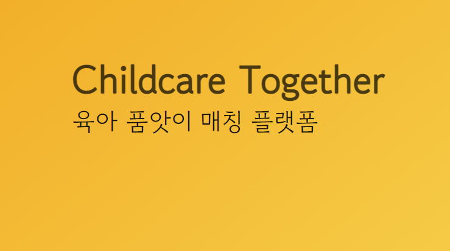

# ChildCare
육아 품앗이 프로젝트 입니다.

## 0. 

 

## 1. 기획의도
  - 육아와 일을 병행하는 것에 힘겨움을 겪는 사람들을 위해 비슷한 지역 사람들끼리 서로 육아품앗이를 할 수 있도록 도와주는 미니 프로젝트

## 2. 기능 및 구성
  - ###기본 기능
      + 회원가입, 로그인
      + 메인 페이지, 검색 기능 (미완)
      + 모집글 올리기, 수정, 삭제
      + 신청하기, 인원 마감, 신청 취소

## 3. 와이어 프레임

## 4. API 설계

